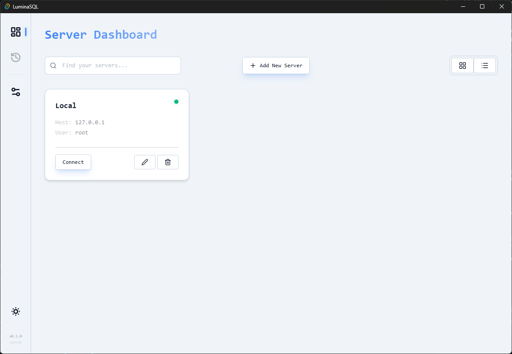

# OmniMIN 🚀

> **Omni**present **M**ongo-to-**I**ncremental-**N**ative Database Manager.

OmniMIN is a high-performance, visual database browser designed to be the modern successor to legacy tools like phpMyAdmin. Built for speed and intelligence, it bridges the gap between NoSQL and SQL.

[ Download App ] [ View Docs ] [ AI Features ]

  
  

---

### Why OmniMIN?
* **M**ongo Support: Native NoSQL exploration with full document visualization.
* **I**ncremental: Efficiently manage SQL schemas and relational data updates.
* **N**ative: Blazing fast performance with zero web-browser overhead.
* **AI-Ready:** Natural language to SQL/MQL translation built-in.

---

## 💡 Key Features

Traditional tools like **phpMyAdmin** require a heavy stack (Apache + PHP) just to manage a database. Electron-based apps often feel sluggish and consume varying amounts of RAM.

- **Native Architecture**: Built with Rust (Tauri) for maximum performance and low memory usage.
- **Secure & Native**: Production builds disable browser-like behaviors (Context Menus, DevTools) for a true desktop app experience.
- **Modern UI**: React 18 + TailwindCSS v4 + Framer Motion.
- **Universal Support**: One tool for MySQL, MariaDB, and upcoming MongoDB/PostgreSQL support.
- **Zero Config**: Just run the executable. Settings are saved locally.

## 🖥️ Supported Platforms

| Platform | Status |
| :--- | :--- |
| **Windows** | ✅ Supported (x64, ARM64) |
| **macOS** | ✅ Supported (Intel, Apple Silicon) |
| **Linux** | ✅ Supported (Debian, Arch, Fedora, etc.) |
| **FreeBSD/OpenBSD** | 🚧 Planned |

---

## ✅ Feature Checklist & Roadmap

### Phase 1: Foundation (Rust + React)
- [x] **Backend Architecture**: Implemented `mysql_async` based connection pooling.
- [x] **Command Set**: `connect_db`, `get_databases`, `get_tables`, `execute_query`.
- [x] **UI Design**: Implemented Glassmorphism design system with Tailwind v4.
- [x] **Theme Support**: Dynamic Dark/Light mode switching.
- [x] **Dashboard**: Sidebar for DBs, Main for Data.
- [x] **Data Grid**: High-performance virtualized table view.

### Phase 2: Multi-Server Dashboard
- [x] **Storage**: Local secure config storage (Rust).
- [x] **Management UI**: Full "Add/Edit/Delete" server management.
- [x] **Grid/List View**: Toggleable layout per user preference.
- [x] **Stats Widget**: Live server status and uptime.

### Phase 3: Information-Dense UI
- [x] **Compact Layout**: Optimized density for power users.
- [x] **Context Bar**: Breadcrumbs for SQL Browser.
- [x] **Tabbed Navigation**: Separate views for Structure, SQL, Designer.
- [x] **Sidebar Explorer**: Nested schema explorer with expand/collapse.

### Phase 8: Schema Designer (Visual Architect)
- [x] **Drag & Drop**: React Flow based table design.
- [x] **Visual Relations**: Foreign Key edges.
- [x] **Advanced Exports**:
  - [x] **Laravel**: Generate Migrations & Eloquent Models.
  - [x] **TypeScript**: Generate Interfaces.
  - [x] **Prisma**: Generate `schema.prisma`.
  - [x] **SQL**: Standard `CREATE TABLE` dumps.

### Phase 10: Universal Database Support (Architecture 2.0)
- [ ] **Refactor Backend**: Abstract `DatabaseDriver` trait.
- [ ] **Drivers**:
  - [ ] `PostgreSQL` (tokio-postgres)
  - [ ] `SQLite` (sqlx-sqlite)
  - [ ] `MSSQL` (tiberius)
  - [ ] `MariaDB` (mysql_async)
  - [ ] `MongoDB` (Native Document Browser)
  - [ ] `Redis` (Key-Value Adapter)

---

## 🛠 Tech Stack

*   **Frontend**: React 18, TypeScript, Zustand, TanStack Query, React Flow, Tailwind CSS v4.
*   **Backend**: Rust (Tauri), Tokio, SQLx/MySQL_Async.
*   **Build Tool**: Vite.

## 🤝 Contributing

We welcome contributions! This project is 100% Open Source.

1.  Clone repo: `git clone https://github.com/ahtesham-clcbws/OmniMIN.git`
2.  Install DB deps: `npm install` (in `www/`)
3.  Run Dev: `npm run tauri dev`

## 📄 License

MIT License - see [LICENSE](LICENSE) for details.
